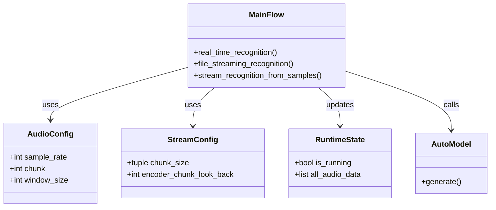
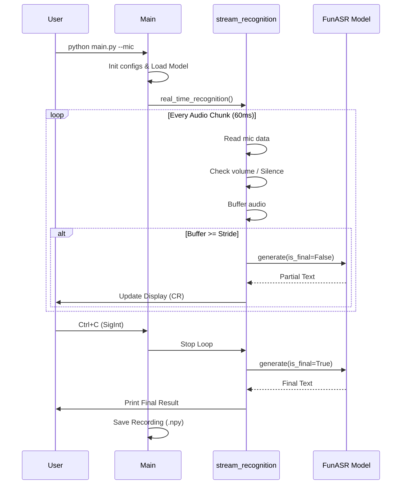

# FunASR 实时语音识别系统

基于 FunASR (Paraformer-zh-streaming) 的实时语音识别系统，支持麦克风实时输入和音频文件流式模拟。

## 功能特性

- **实时识别**: 支持麦克风实时采集与流式识别。
- **文件模拟**: 支持加载 `.npy` 音频文件模拟流式输入，用于测试和验证。
- **自动验证**: 内置基准文本比对功能，计算识别结果与标准答案的相似度。
- **静音检测**: 基于音量阈值的静音/小声/正常/大声状态检测。
- **录音保存**: 自动保存所有识别过程中的音频数据为 `.npy` 文件。
- **滑动窗口**: 可配置的音频块大小和滑动窗口机制。

## 快速开始

### 依赖安装

本项目使用 `uv` 进行依赖管理。

```bash
uv sync
```

### 实时麦克风识别

```bash
uv run python main.py --mic
```
运行后对麦克风说话，终端将实时输出识别结果。按 `Ctrl+C` 停止，程序会自动保存录音文件。

### 音频文件流式模拟

使用预先录制的 `.npy` 文件进行测试：

```bash
uv run python main.py --audio_file debug_audio.npy --benchmark "你好世界"
```
这将模拟流式输入并自动计算与 "你好世界" 的相似度。

## 项目架构

### 核心配置

系统主要通过以下三个数据类进行配置和状态管理：

- **`AudioConfig`**: 音频参数配置。
  - `sample_rate`: 采样率 (默认 16000)
  - `chunk`: 每次读取的音频帧数 (60ms)
  - `window_size`: 滑动窗口大小 (300ms)
  - `step_size`: 滑动步长 (60ms)

- **`StreamConfig`**: 模型流式参数。
  - `chunk_size`: 解码块大小配置
  - `encoder/decoder_chunk_look_back`: 前瞻帧数

- **`RuntimeState`**: 运行时状态。
  - `is_running`: 控制主循环退出
  - `all_audio_data`: 累积所有音频数据

### 架构图



### 核心流程

主要的处理逻辑在 `stream_recognition_from_samples` 函数中：

1. **输入源**: 接受 `sample_iter`（来自麦克风或文件）。
2. **缓冲**: 累积音频数据到 `audio_cache`。
3. **预处理**: 增益调整、裁剪、类型转换 (`preprocess_audio`)。
4. **推理**: 当缓存满足步长时，调用 `model.generate` 进行流式推理。
5. **输出**: 实时打印中间结果，合并文本流 (`merge_stream_text`)。
6. **收尾**: 循环结束后进行最后一次推理 (`is_final=True`)。

### 时序图



## 工具脚本

- `play_npy_audio.py`: 将保存的 `.npy` 原始音频数据转换为 `.wav` 并播放。

```bash
uv run python play_npy_audio.py recording_20240101.npy --output test.wav --play
```
